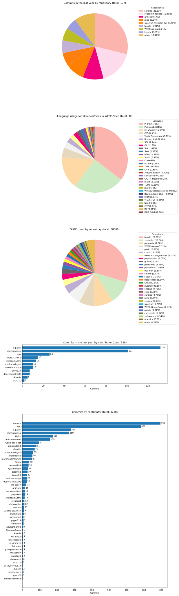

# 🐟 S.A.R.D.I.N.A. 🐟
Statistiche Amabili Rendimento Degli Informatici Nell’Anno

## What

A Python script to quickly compute how much we've worked in terms of:
- yearly commits
- contributors commits
- LOC  

all three both per repository and total. And it also generates cool graphs!

All non-archived and non-disabled public repos are taken into consideration.

## How

Count our commits:
- some 🐍 magic
- GitHub [APIs](https://docs.github.com/en/free-pro-team@latest/rest/reference/repos#statistics)
- the `requests` library

Count our SLOC (Source Lines Of Code): 
- `git ls-files` to list repo files
- `sed '/^\s*$/d' $file` to remove whitespace-only lines
- `wc -l` to count lines  
or, optionally
- `cloc` - a dedicated [utility](https://github.com/AlDanial/cloc) to count lines of code

## Why

For our yearly report and recruitment presentation.  
Also, we are curious nerds.

## I want to run it now!

First of all, generate a Personal Access Token (PAT) from your GitHub's [developer settings](https://github.com/settings/tokens) page.  
The token only needs access to the APIs so you can leave all the permission boxes unticked and generate a token that can only access your public information and has no control over your account, but still benefit from the 5000 API requests per hour of authenticated requests.  

You can skip this step if you want and use the script without a PAT, but you will be subject to a limit of 60 API requests per hour, which means you could only fetch complete statistics for an account with at most 30 repos (we have 32 at the moment, so a PAT is highly recommended).

The configuration is done in `config.py`. There you can paste your PAT generated at the previous step, and configure for which owner you want to see the stats (either a user or an organization), where you want to save the output, and if you want to run the script in development mode.

`git clone https://github.com/weee-open/sardina`  
`cd sardina`  
optional: `python3 -m venv venv`  
optional: `source venv/bin/activate`  
`pip install -r requirements.txt`  
`vim config.py`  
`python main.py`  
optional: `deactivate`

## Development

Having to make all the necessary requests and clone all the repositories in order to test changes to the program is long, makes having a stable internet connection a requirement and hammers GitHub's servers with unnecessary requests. Therefore we included a couple of options into `config.py` that can make a developer's job simpler:

* `dev_mode`: enables local caching of all GitHub API responses (list of repos, contributions and other statistics)
* `keep_repos`: enables long-term storage of cloned repositories instead of deleting them after each run. Keep in mind your available storage!
